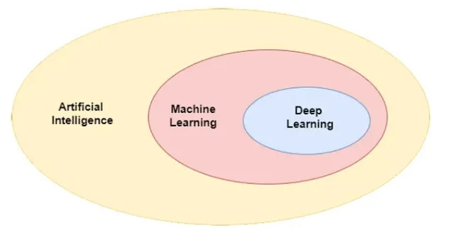

# Why Deep Learning Is Changing the World: A Beginner’s Guide to AI and Neural Networks

My name is Yash, and welcome to my new blog! In this post, we’re going to dive into one of the hottest topics in the world of technology: **Deep Learning**.

## Here’s what we’ll cover:

- What is Deep Learning?
- Understanding AI, Machine Learning, and Deep Learning.
- What is Machine Learning?
- What is Deep Learning?
- What is an Artificial Neural Network (ANN)?
- Types of Neural Networks.
- Why is Deep Learning So Popular?
- Deep Learning vs Machine Learning: Key Differences.
- Why is Deep Learning Famous Today?

Let’s get started!

## What is deep learning?
> "Deep learning is a part of AI and machine learning that uses neural networks with many layers, inspired by how the human brain works. It helps solve complex problems like recognising images or understanding language."

## Understanding AI, Machine Learning, and Deep Learning
Artificial Intelligence (**AI**) is the big umbrella term under which everything else falls. It’s all about making machines smart — just like humans. We’ve been working on AI for over 100 years, and while we’ve made some progress, there’s still a lot more to achieve. One important area of AI that’s already developed is **machine learning (ML)**.

## What is Machine Learning?
Machine learning is a subfield of AI. The goal of ML is to help machines learn from data. If you have data with inputs (like a question) and outputs (like an answer), machine learning’s job is to figure out the relationship between the input and output. In simple terms, it predicts the output based on the input by finding patterns in the data.

Most machine learning methods are based on statistics. They use mathematical algorithms to identify and map these relationships. For example, if you give ML a lot of data about house sizes (**input**) and their prices (**output**), it can predict the price of a new house based on its size.

## What is Deep Learning?
Deep Learning is a subset of Machine Learning, but it’s more advanced. While Machine Learning algorithms mostly rely on statistical methods to find patterns in the data, Deep Learning uses something called a **neural network**, which is inspired by the human brain.

Neural networks in Deep Learning consist of layers of interconnected nodes (also known as “neurons”), which help understand more complex patterns. This structure allows Deep Learning models to learn from large amounts of data in a way that is much closer to how the human brain works.

The main difference is that Deep Learning goes beyond traditional statistical methods and uses logical structures (**neural networks**) to solve problems, making it more powerful and capable of handling complex tasks like **image recognition, speech processing, and more**.

### Summary:
- **AI** is the broad field of making machines intelligent.
- **Machine Learning** is a part of AI that focuses on teaching machines to learn from data.
- **Deep Learning** is a more advanced form of Machine Learning that uses neural networks inspired by the human brain.

## What is an Artificial Neural Network (ANN)?
An **Artificial Neural Network (ANN)** is a type of logical structure used in deep learning. It’s made up of small units called **perceptrons**, which are the building blocks of the network. These perceptrons are connected to each other by arrows, called **weights**, which help the network process information.

### The structure of an ANN is organized into layers:
- **Input Layer**: This is where we feed in the data, like numbers or images.
- **Output Layer**: This is where we get the final result or prediction.
- **Hidden Layers**: These are layers in between the input and output. Hidden layers process the data and help the network learn complex patterns.

The more **hidden layers** an ANN has, the **deeper** the network becomes — this is where the term **“deep learning”** comes from! A deep neural network with many hidden layers can solve more complex problems by identifying intricate patterns in data.

## Types of Neural Networks:
There are several types of neural networks, each designed for specific tasks:

- **ANN (Artificial Neural Network)**: The most basic type of neural network, used for general tasks.
- **CNN (Convolutional Neural Network)**: Specially designed for working with images, such as recognizing objects in pictures.
- **RNN (Recurrent Neural Network)**: Used for sequential data like text or speech, making it great for language translation or voice recognition.
- **GAN (Generative Adversarial Network)**: A unique type of network that can create new data, such as generating realistic images or writing text.

## Why is Deep Learning So Popular?
Deep learning has become incredibly famous in recent years, and there are two main reasons for this:

### 1. Wide Applicability
Deep learning can be used in almost every field:
- **Computer Vision** (recognizing objects in images)
- **Speech Recognition** (voice assistants)
- **Natural Language Processing (NLP)** (chatbots and language translation)

### 2. Outstanding Performance
Deep learning delivers **incredible results**, often outperforming traditional methods. In some cases, deep learning models have even surpassed **human-level performance**.

## Deep Learning vs Machine Learning: Key Differences

| Feature | Machine Learning | Deep Learning |
|---------|----------------|---------------|
| **Data Dependency** | Works well with smaller datasets | Requires a lot of data |
| **Hardware Dependency** | Can run on a CPU | Requires powerful GPUs/TPUs |
| **Training Time** | Shorter | Longer |
| **Feature Selection** | Manually engineered | Learns automatically |
| **Interpretability** | High (easy to understand) | Low (black-box models) |

## Why is Deep Learning Famous Today?
Deep learning has been around for decades but gained popularity in recent years due to five key factors:

### 1. **Datasets**
- The **Smartphone** and **Internet Revolutions** generated **massive amounts of data**.
- Publicly available datasets like **ImageNet** helped researchers train and test models.

### 2. **Hardware**
- **GPUs**: NVIDIA introduced CUDA for deep learning.
- **Custom Chips**: TPUs, NPUs, and Edge TPUs made training and deployment faster.

### 3. **Frameworks and Libraries**
- **TensorFlow (by Google)** and **PyTorch (by Meta)** made building models easier.

### 4. **Architectures**
- Pre-built architectures like **ResNet, BERT, U-Net, YOLO, and WaveNet** save time and improve performance.

### 5. **Community**
- Platforms like **Kaggle** and **Hugging Face** help researchers share knowledge and advance deep learning.

---

## And that’s a wrap!

Thank you for reading my blog. If you enjoyed this blog or have any questions, feel free to share your thoughts in the comments. I’d love to hear from you! Don’t forget to stay tuned for more exciting content in the future.
