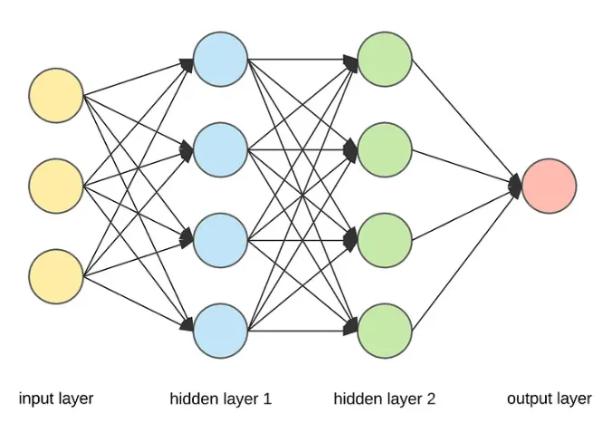

# Welcome to My New Blog!

## Deep Learning: The Hottest Topic in Technology

### Here’s what we’ll cover:
- What is Deep Learning?
- Understanding AI, Machine Learning, and Deep Learning.
- What is Machine Learning?
- What is Deep Learning?
- What is an Artificial Neural Network (ANN)?
- Types of Neural Networks.
- Why is Deep Learning So Popular?
- Deep Learning vs Machine Learning: Key Differences.
- Why is Deep Learning Famous Today?

Let’s get started!

---

## What is Deep Learning?
> “Deep learning is a part of AI and machine learning that uses neural networks with many layers, inspired by how the human brain works. It helps solve complex problems like recognizing images or understanding language.”

---

## Understanding AI, Machine Learning, and Deep Learning
Artificial Intelligence (AI) is the big umbrella term under which everything else falls. It’s all about making machines smart — just like humans. We’ve been working on AI for over 100 years, and while we’ve made some progress, there’s still a lot more to achieve. One important area of AI that’s already developed is machine learning (ML).

---

## What is Machine Learning?
Machine learning is a subfield of AI. The goal of ML is to help machines learn from data. If you have data with inputs (like a question) and outputs (like an answer), machine learning’s job is to figure out the relationship between the input and output. In simple terms, it predicts the output based on the input by finding patterns in the data.

Most machine learning methods are based on statistics. They use mathematical algorithms to identify and map these relationships. For example, if you give ML a lot of data about house sizes (input) and their prices (output), it can predict the price of a new house based on its size.

---

## What is Deep Learning?
Deep Learning is a subset of Machine Learning, but it’s more advanced. While Machine Learning algorithms mostly rely on statistical methods to find patterns in the data, Deep Learning uses something called a neural network, which is inspired by the human brain.

Neural networks in Deep Learning consist of layers of interconnected nodes (also known as “neurons”), which help understand more complex patterns. This structure allows Deep Learning models to learn from large amounts of data in a way that is much closer to how the human brain works.

### AI vs Machine Learning vs Deep Learning:
- **AI** is the broad field of making machines intelligent.
- **Machine Learning** is a part of AI that focuses on teaching machines to learn from data.
- **Deep Learning** is a more advanced form of Machine Learning that uses neural networks inspired by the human brain.

---

## What is an Artificial Neural Network (ANN)?
An **Artificial Neural Network (ANN)** is a type of logical structure used in deep learning. It’s made up of small units called **perceptrons**, which are the building blocks of the network. These perceptrons are connected to each other by arrows, called **weights**, which help the network process information.

### Structure of an ANN:
- **Input Layer**: This is where we feed in the data, like numbers or images.
- **Output Layer**: This is where we get the final result or prediction.
- **Hidden Layers**: These are layers in between the input and output. Hidden layers process the data and help the network learn complex patterns.

The more hidden layers an ANN has, the deeper the network becomes — this is where the term **“deep learning”** comes from!

---

## Types of Neural Networks:
- **ANN (Artificial Neural Network)**: The most basic type of neural network, used for general tasks.
- **CNN (Convolutional Neural Network)**: Specially designed for working with images, such as recognizing objects in pictures.
- **RNN (Recurrent Neural Network)**: Used for sequential data like text or speech, making it great for language translation or voice recognition.
- **GAN (Generative Adversarial Network)**: A unique type of network that can create new data, such as generating realistic images or writing text.

---

## Why is Deep Learning So Popular?
### 1. Wide Applicability
Deep learning can be used in almost every field: 
- **Computer vision** (like recognizing objects in images),
- **Speech recognition** (like voice assistants),
- **Natural Language Processing (NLP)** (chatbots and language translation), and more.

### 2. Outstanding Performance
Deep learning models deliver **state-of-the-art performance**, often outperforming traditional methods. They can even surpass human-level performance in some cases.

---

## Deep Learning vs Machine Learning: Key Differences
| Feature | Machine Learning | Deep Learning |
|---------|----------------|--------------|
| **Data Dependency** | Works well with smaller datasets | Requires vast amounts of data |
| **Hardware Dependency** | Can run on local CPU | Needs powerful GPUs or TPUs |
| **Training Time** | Shorter | Longer but faster at predictions |
| **Feature Selection** | Manually selected | Extracts features automatically |
| **Interpretability** | High | Low (black-box models) |

---

## Why is Deep Learning Famous Today?
Deep learning has been around since the 1960s, but it became a major breakthrough around 2012 due to **five key factors:**

### 1. Datasets
With the **smartphone and internet revolution**, companies started generating massive amounts of **labeled** data, which deep learning requires.

### 2. Hardware
- **GPUs (Graphics Processing Units)**: Process multiple tasks simultaneously, making them ideal for deep learning.
- **TPUs (Tensor Processing Units)**: Specialized chips for training deep learning models.
- **NPUs (Neural Processing Units)**: Found in smartphones for AI applications.

### 3. Frameworks and Libraries
Deep learning development is simplified with powerful tools like:
- **TensorFlow (by Google)**
- **PyTorch (by Meta)**

### 4. Pre-Built Architectures
Instead of building neural networks from scratch, researchers use **pre-trained architectures** like:
- **ResNet** (Image classification)
- **BERT** (Text classification)
- **YOLO** (Object detection)
- **WaveNet** (Speech generation)

### 5. Community
A **global research community** (Kaggle, Huggingface, etc.) shares knowledge, tools, and innovations, making deep learning more accessible and advancing its applications.

---

## Conclusion
Deep learning has revolutionized the tech industry, powering advancements in AI. With powerful hardware, large datasets, efficient frameworks, and a strong community, its growth is unstoppable. Whether you’re interested in computer vision, NLP, or robotics, deep learning is a game-changer!

That’s a wrap! 🚀

---
